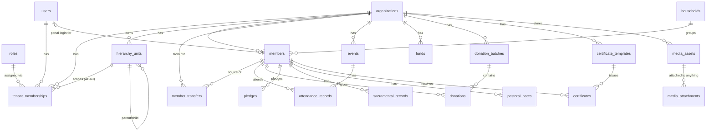

# EcclesiaFlow — Database Design

A shared-database, multi-tenant schema for PostgreSQL, designed to back the
screens already built in this frontend (see `src/types/*.ts` and
`src/mocks/*.ts` — every table below traces back to a type or a mock service
that already exists). Aligns with the stack and module boundaries set out in
`/plan.md` (FastAPI, SQLAlchemy v2 async, closure-table hierarchy, `resource:action`
RBAC).

Two requirements drove the two hardest parts of this design:

1. **Shared database, high-security tenant isolation.** One Postgres instance,
   one set of tables, every tenant's rows interleaved in the same tables —
   enforced not just by `WHERE tenant_id = ?` application discipline (easy to
   forget in one query and leak data) but by Postgres **Row-Level Security**,
   so the database itself refuses a cross-tenant read even if the application
   layer has a bug.
2. **A person can belong to more than one church, and a member can transfer
   from one church to another, efficiently.** These are two different
   problems that are easy to conflate:
   - *Switching active church* (a staff member of Church A who is also a board
     member of a diocese, or just moves their login between churches) is a
     **session-level** concern — no data should move at all.
   - *Transferring a congregant's membership* from Church A to Church B (the
     classic "letter of transfer") is a **data-level** operation — a new
     record is created in the new church, selected history optionally moves
     with it, and it has to happen as one atomic, set-based operation, not a
     slow row-by-row copy loop.

Both are modeled explicitly below, in their own sections.

---

## 1. Principles

- **Pool model, not schema-per-tenant.** Every tenant-scoped table carries a
  `tenant_id uuid not null`. This scales to thousands of tenants on one
  schema and keeps migrations a single operation, at the cost of needing real
  isolation enforcement — which is what RLS is for.
- **Only two tables have no `tenant_id`:** `organizations` (the tenant catalog
  itself — churches need to be findable *before* a tenant context exists, e.g.
  the public church-selection landing page) and `users` (a login identity is
  global; which churches it belongs to is a separate join table, see §3).
- **One legitimate cross-tenant table:** `member_transfers` (§6). Everything
  else is single-tenant per row.
- **RLS is the enforcement boundary, not a nice-to-have.** Every tenant-scoped
  table gets `ENABLE ROW LEVEL SECURITY` plus a policy keyed off a Postgres
  session variable (`app.tenant_id`) that the API layer sets once per request
  from the authenticated user's active tenant membership. A compromised or
  buggy query still can't cross tenants, because the database connection
  itself can only see one tenant's rows at a time.
- **RBAC + ABAC is one model, not two.** The frontend audit found a real gap:
  `useRole.ts`'s hardcoded `ROLE_PERMISSIONS` map and the Team/Custom-Role-Builder
  UI are two disconnected systems today. This schema has one `roles` /
  `role_permissions` table pair that both the system defaults (member/staff/board)
  and tenant-defined custom roles live in, plus `unit_scope_id` on the
  membership row for the ABAC dimension (a role scoped to one branch, not the
  whole org).
- **Nothing here invents a feature the frontend doesn't already expect.**
  Column names and shapes are pulled directly from `MemberDetail`, `ChurchEvent`,
  `Donation`, `CustomRole`, `TeamMember`, `Household`, `Organisation`, etc. Where
  this schema needs something the frontend's current types don't model yet
  (multi-tenant membership per user), it's called out explicitly in §8 rather
  than silently changing the contract.

---

## 2. Entity overview



---

## 3. Identity & tenancy

```sql
create extension if not exists pgcrypto;   -- gen_random_uuid()
create extension if not exists citext;     -- case-insensitive email

-- ═══════════════════════════════════════════════════════════════════════
-- The tenant catalog. No tenant_id — this table IS the tenant list.
-- Backs OrgListItem / Organisation and the public church-selection search.
-- ═══════════════════════════════════════════════════════════════════════
create table organizations (
  id               uuid primary key default gen_random_uuid(),
  legal_name       text not null,
  display_name     text not null,
  slug             text not null unique,      -- "st-judes" — public lookup key
  country          char(2) not null,
  currency         char(3) not null,
  timezone         text not null,
  language         text not null default 'en',
  status           text not null default 'trial'
                     check (status in ('trial','active','suspended','canceled')),
  tier             text not null default 'seed'
                     check (tier in ('free','seed','parish','growth','diocese','enterprise')),
  logo_url         text,
  primary_color    text,
  custom_domain    text unique,
  trial_ends_at    timestamptz,
  renewal_date     timestamptz,
  storage_used_mb  integer not null default 0,
  created_at       timestamptz not null default now(),
  updated_at       timestamptz not null default now()
);
create index organizations_status_idx on organizations (status);

-- Only churches a visitor is allowed to discover show up in search —
-- keeps suspended/canceled orgs out of the public landing page's lookup.
create index organizations_public_lookup_idx on organizations (slug)
  where status in ('trial','active');

-- ═══════════════════════════════════════════════════════════════════════
-- Global login identity. NOT tenant-scoped — see §8 for why this is a
-- deliberate change from the frontend's current single-tenant User type.
-- ═══════════════════════════════════════════════════════════════════════
create table users (
  id                    uuid primary key default gen_random_uuid(),
  email                 citext not null unique,
  password_hash         text,                 -- null if magic-link/SSO only
  first_name            text not null,
  last_name             text not null,
  photo_url             text,
  is_platform_admin     boolean not null default false,
  platform_admin_level  text check (platform_admin_level in ('full','support')),
  mfa_enabled           boolean not null default false,
  mfa_secret            text,                 -- encrypted at rest (application-layer envelope encryption)
  mfa_backup_codes      text[],               -- hashed, never stored plain
  status                text not null default 'active'
                          check (status in ('active','locked','disabled')),
  created_at            timestamptz not null default now(),
  last_login_at         timestamptz
);

-- ═══════════════════════════════════════════════════════════════════════
-- One row per (user, church). This is the whole mechanism for "a user can
-- change church": switching = picking a different row, zero data movement.
-- Backs TeamMember (roleId, roleName, unitScope, unitScopeName).
-- ═══════════════════════════════════════════════════════════════════════
create table tenant_memberships (
  id              uuid primary key default gen_random_uuid(),
  user_id         uuid not null references users(id) on delete cascade,
  tenant_id       uuid not null references organizations(id) on delete cascade,
  role_id         uuid not null references roles(id),
  unit_scope_id   uuid references hierarchy_units(id),   -- ABAC: null = whole org
  status          text not null default 'active'
                    check (status in ('active','invited','suspended')),
  is_primary      boolean not null default false,        -- which one opens by default at login
  invited_at      timestamptz,
  accepted_at     timestamptz,
  last_active_at  timestamptz,
  created_at      timestamptz not null default now(),
  unique (user_id, tenant_id)
);
create index tenant_memberships_tenant_idx on tenant_memberships (tenant_id);
create index tenant_memberships_user_idx on tenant_memberships (user_id);

-- A user may have several memberships, but at most one marked primary.
create unique index tenant_memberships_one_primary_idx on tenant_memberships (user_id)
  where is_primary;
```

> `tenant_memberships` references `roles` and `hierarchy_units`, both defined
> next — in a real migration tool these three go in one migration; order
> shown here is narrative, not execution order.

---

## 4. RBAC + ABAC (one model)

```sql
-- System roles (tenant_id null — member/staff/board, seeded once, shared by
-- every tenant) and tenant-defined custom roles (CustomRoleBuilder) are the
-- same table. A screen that calls can('finance:read') never needs to know
-- which kind of role granted it.
create table roles (
  id          uuid primary key default gen_random_uuid(),
  tenant_id   uuid references organizations(id) on delete cascade,  -- null = system role
  name        text not null,
  color       text,
  is_system   boolean not null default false,   -- system roles can't be deleted (CustomRole.isSystem)
  created_at  timestamptz not null default now(),
  unique (tenant_id, name)
);

create table role_permissions (
  role_id     uuid not null references roles(id) on delete cascade,
  permission  text not null,   -- "resource:action", e.g. "finance:read", "members:export"
  primary key (role_id, permission)
);

-- Seed: the three system roles, permissions copied straight from the
-- existing ROLE_PERMISSIONS map in src/hooks/useRole.ts so enforcement
-- doesn't silently diverge from what the frontend already assumes.
insert into roles (id, tenant_id, name, is_system) values
  ('00000000-0000-0000-0000-000000000001', null, 'member', true),
  ('00000000-0000-0000-0000-000000000002', null, 'staff',  true),
  ('00000000-0000-0000-0000-000000000003', null, 'board',  true);
-- role_permissions rows: one insert per string already in ROLE_PERMISSIONS[role].
```

```sql
-- Hierarchy (Diocese → Parish → Zone → Branch, tenant-configurable labels).
-- Closure table per /plan.md — O(1) "all descendants" / "all ancestors" at
-- any depth without a recursive CTE on every request.
create table hierarchy_units (
  id              uuid primary key default gen_random_uuid(),
  tenant_id       uuid not null references organizations(id) on delete cascade,
  parent_id       uuid references hierarchy_units(id),
  name            text not null,
  type            text not null,     -- "Diocese" | "Parish" | "Zone" | "Branch" | ... (tenant-configurable)
  code            text,
  address         text,
  created_at      timestamptz not null default now()
);
create index hierarchy_units_tenant_idx on hierarchy_units (tenant_id);

create table hierarchy_closure (
  ancestor_id    uuid not null references hierarchy_units(id) on delete cascade,
  descendant_id  uuid not null references hierarchy_units(id) on delete cascade,
  depth          integer not null,
  primary key (ancestor_id, descendant_id)
);
create index hierarchy_closure_descendant_idx on hierarchy_closure (descendant_id);
-- Maintained by an AFTER INSERT/UPDATE trigger on hierarchy_units (insert a
-- self-row at depth 0, then cross-join the new unit into every ancestor of
-- its parent at depth+1). Omitted here for length; standard closure-table
-- maintenance trigger.
```

**How an ABAC check reads in practice:** a permission check is no longer just
"does this role have `attendance:create`" — it's "does this role have
`attendance:create`, *and* is the target event's `unit_id` inside (or equal
to) the membership's `unit_scope_id`'s subtree" — answered with one join
against `hierarchy_closure` (`unit_scope_id` as ancestor, event's `unit_id` as
descendant), not an application-layer tree walk.

---

## 5. People — members, households

```sql
create table households (
  id                uuid primary key default gen_random_uuid(),
  tenant_id         uuid not null references organizations(id) on delete cascade,
  name              text not null,                 -- "The Smith Household"
  head_member_id    uuid,                            -- FK added after members exists (circular)
  address_line1     text,
  address_line2     text,
  city              text,
  state             text,
  country           text,
  postal_code       text,
  total_giving      numeric(12,2) not null default 0,  -- maintained by trigger summing members' donations
  created_at        timestamptz not null default now()
);
create index households_tenant_idx on households (tenant_id);

create table members (
  id                          uuid primary key default gen_random_uuid(),
  tenant_id                   uuid not null references organizations(id) on delete cascade,
  user_id                     uuid references users(id),       -- set only if this person also has portal login
  household_id                uuid references households(id),
  first_name                  text not null,
  last_name                   text not null,
  preferred_name              text,
  photo_url                   text,
  email                       citext,
  phone                       text,
  whatsapp                    text,
  status                      text not null default 'active'
                                check (status in ('active','visitor','inactive','prospect')),
  envelope_number             text,
  unit_id                     uuid references hierarchy_units(id),
  joined_at                   date,
  last_seen_at                date,
  date_of_birth               date,
  gender                      text,
  marital_status              text,
  occupation                  text,
  address_line1               text,
  address_line2               text,
  city                        text,
  state                       text,
  country                     text,
  postal_code                 text,
  -- Transfer lineage — see §6. Both nullable; at most one is ever set.
  transferred_to_member_id    uuid references members(id),
  transferred_from_member_id  uuid references members(id),
  created_at                  timestamptz not null default now(),
  updated_at                  timestamptz not null default now()
);
create index members_tenant_idx on members (tenant_id);
create index members_tenant_envelope_idx on members (tenant_id, envelope_number);
create index members_household_idx on members (household_id);

-- A user can portal-login as at most one member PER tenant (but may have a
-- members row in several tenants, once per church they belong to).
create unique index members_tenant_user_idx on members (tenant_id, user_id)
  where user_id is not null;

alter table households
  add constraint households_head_member_fk
  foreign key (head_member_id) references members(id);

create table sacramental_records (
  id              uuid primary key default gen_random_uuid(),
  tenant_id       uuid not null references organizations(id) on delete cascade,
  member_id       uuid not null references members(id) on delete cascade,
  type            text not null,     -- Baptism, Confirmation, Marriage, ...
  date            date not null,
  officiant_name  text,
  location        text,
  notes           text,
  created_at      timestamptz not null default now()
);
create index sacramental_records_member_idx on sacramental_records (tenant_id, member_id);

create table pastoral_notes (
  id               uuid primary key default gen_random_uuid(),
  tenant_id        uuid not null references organizations(id) on delete cascade,
  member_id        uuid not null references members(id) on delete cascade,
  content          text not null,
  author_user_id   uuid not null references users(id),
  is_private       boolean not null default true,
  created_at       timestamptz not null default now(),
  updated_at       timestamptz not null default now()
);
create index pastoral_notes_member_idx on pastoral_notes (tenant_id, member_id);
```

---

## 6. Member transfer — the cross-tenant operation

This is the one place in the schema where two tenants legitimately need to
see the same row, so it's modeled as its own narrow, audited gateway table
rather than loosening isolation anywhere else.

```sql
create table member_transfers (
  id                     uuid primary key default gen_random_uuid(),
  from_tenant_id         uuid not null references organizations(id),
  to_tenant_id           uuid not null references organizations(id),
  from_member_id         uuid not null references members(id),
  to_member_id           uuid references members(id),     -- filled in once completed
  requested_by_user_id   uuid not null references users(id),
  approved_by_user_id    uuid references users(id),
  status                 text not null default 'pending'
                           check (status in ('pending','approved','completed','rejected','canceled')),
  history_scope          text not null default 'identity_only'
                           check (history_scope in ('identity_only','include_sacraments','full_history')),
  certificate_id         uuid references certificates(id),  -- auto-issued "Certificate of Transfer"
  notes                  text,
  requested_at           timestamptz not null default now(),
  decided_at             timestamptz,
  completed_at           timestamptz,
  check (from_tenant_id <> to_tenant_id)
);
create index member_transfers_from_idx on member_transfers (from_tenant_id);
create index member_transfers_to_idx on member_transfers (to_tenant_id);
create index member_transfers_member_idx on member_transfers (from_member_id);
```

**Policy choices baked into `history_scope`, decided once here rather than
re-litigated per transfer:**

- `identity_only` (default) — name, contact info, DOB move. Nothing else.
- `include_sacraments` — the above, plus sacramental record (baptism follows
  the person, most denominations treat it as permanent).
- `full_history` — reserved for intra-diocese transfers where both churches
  are the same legal entity; still never includes donations (see below).

**Giving/donation history never moves, under any scope.** A donation is the
*originating church's* financial and legal record (tax receipts, audit
trail) — it stays put regardless of where the person worships now. This
mirrors how the certificates module already treats a "Certificate of
Transfer" as the hand-off artifact, not a data migration.

### The transfer itself — one transaction, set-based, not row-by-row

```sql
create or replace function execute_member_transfer(p_transfer_id uuid)
returns uuid
language plpgsql
security definer   -- this function is the only thing allowed to write across
                    -- the tenant boundary; every other code path stays single-tenant
as $$
declare
  v_transfer  member_transfers%rowtype;
  v_new_id    uuid;
begin
  select * into v_transfer
  from member_transfers
  where id = p_transfer_id and status = 'approved'
  for update;

  if not found then
    raise exception 'Transfer % is not in an approved state', p_transfer_id;
  end if;

  -- 1. Identity, in one INSERT ... SELECT. Never the source row's id, never
  --    its financial fields.
  insert into members (
    tenant_id, first_name, last_name, preferred_name, photo_url,
    email, phone, whatsapp, status, date_of_birth, gender,
    marital_status, occupation, transferred_from_member_id
  )
  select
    v_transfer.to_tenant_id, first_name, last_name, preferred_name, photo_url,
    email, phone, whatsapp, 'active', date_of_birth, gender,
    marital_status, occupation, id
  from members
  where id = v_transfer.from_member_id
  returning id into v_new_id;

  -- 2. Optional history, each a single bulk UPDATE — O(1) round-trips no
  --    matter how many rows exist, unlike a per-record copy loop.
  if v_transfer.history_scope in ('include_sacraments', 'full_history') then
    update sacramental_records
       set tenant_id = v_transfer.to_tenant_id, member_id = v_new_id
     where member_id = v_transfer.from_member_id;
  end if;

  -- 3. Close out the source record rather than deleting it, so the old
  --    church's attendance sheets and donation batches keep resolving.
  update members
     set status = 'inactive', transferred_to_member_id = v_new_id, updated_at = now()
   where id = v_transfer.from_member_id;

  update member_transfers
     set status = 'completed', to_member_id = v_new_id, completed_at = now()
   where id = p_transfer_id;

  return v_new_id;
end;
$$;
```

One function call, three statements, one transaction, each statement
set-based — "efficient" here means *not* opening a connection per related
table per row, which is the usual way this kind of migration becomes slow.

---

## 7. Everything else (events, finance, comms, certificates, media, audit)

All standard single-tenant tables — straightforward `tenant_id` + the shape
already defined by the matching frontend type. Shown compactly; every column
maps 1:1 to a field already in `src/types/`.

```sql
-- Events & attendance — backs ChurchEvent / EventListItem / AttendanceRecord
create table events (
  id                  uuid primary key default gen_random_uuid(),
  tenant_id           uuid not null references organizations(id) on delete cascade,
  title               text not null,
  type                text not null check (type in ('service','meeting','event','prayer','outreach','other')),
  description         text,
  location            text,
  start_date_time     timestamptz not null,
  end_date_time       timestamptz,
  is_recurring        boolean not null default false,
  recurrence_rule     text,
  status              text not null default 'draft' check (status in ('draft','published','canceled','completed')),
  unit_id             uuid references hierarchy_units(id),
  attendance_mode     text not null default 'individual' check (attendance_mode in ('individual','headcount')),
  is_public           boolean not null default false,
  created_by_user_id  uuid not null references users(id),
  created_at          timestamptz not null default now(),
  updated_at          timestamptz not null default now()
);
create index events_tenant_start_idx on events (tenant_id, start_date_time);

create table attendance_records (
  id                  uuid primary key default gen_random_uuid(),
  tenant_id           uuid not null references organizations(id) on delete cascade,
  event_id            uuid not null references events(id) on delete cascade,
  mode                text not null check (mode in ('individual','headcount')),
  member_id           uuid references members(id),
  adult_count         integer,
  child_count         integer,
  total_count         integer,
  marked_at           timestamptz not null default now(),
  marked_by_user_id   uuid not null references users(id)
);
create index attendance_tenant_event_idx on attendance_records (tenant_id, event_id);
create unique index attendance_one_per_member_idx on attendance_records (event_id, member_id)
  where member_id is not null;

-- Finance — backs Fund / DonationBatch / Donation / Pledge
create table funds (
  id               uuid primary key default gen_random_uuid(),
  tenant_id        uuid not null references organizations(id) on delete cascade,
  name             text not null,
  description      text,
  is_default       boolean not null default false,
  target           numeric(12,2),
  total_received   numeric(12,2) not null default 0,
  is_active        boolean not null default true,
  created_at       timestamptz not null default now()
);
create index funds_tenant_idx on funds (tenant_id);

create table donation_batches (
  id                  uuid primary key default gen_random_uuid(),
  tenant_id           uuid not null references organizations(id) on delete cascade,
  name                text not null,
  description         text,
  service_id          uuid references events(id),
  date                date not null,
  status              text not null default 'open' check (status in ('open','closed','posted')),
  verified_total      numeric(12,2),
  created_by_user_id  uuid not null references users(id),
  closed_at           timestamptz,
  posted_at           timestamptz,
  created_at          timestamptz not null default now()
);
create index donation_batches_tenant_status_idx on donation_batches (tenant_id, status);

create table donations (
  id                  uuid primary key default gen_random_uuid(),
  tenant_id           uuid not null references organizations(id) on delete cascade,
  batch_id            uuid not null references donation_batches(id) on delete cascade,
  member_id           uuid references members(id),
  is_guest            boolean not null default false,
  guest_name          text,
  envelope_number     text,
  fund_id             uuid not null references funds(id),
  amount              numeric(12,2) not null check (amount > 0),
  payment_method      text not null check (payment_method in ('cash','check','card','transfer','mobile_money')),
  notes               text,
  reference_number    text,
  is_voided           boolean not null default false,
  voided_at           timestamptz,
  void_reason         text,
  voided_by_user_id   uuid references users(id),
  created_by_user_id  uuid not null references users(id),
  created_at          timestamptz not null default now()
);
create index donations_tenant_batch_idx on donations (tenant_id, batch_id);
create index donations_tenant_member_idx on donations (tenant_id, member_id);

create table pledges (
  id                 uuid primary key default gen_random_uuid(),
  tenant_id          uuid not null references organizations(id) on delete cascade,
  member_id          uuid not null references members(id),
  fund_id            uuid not null references funds(id),
  pledge_amount      numeric(12,2) not null,
  amount_fulfilled   numeric(12,2) not null default 0,
  start_date         date not null,
  end_date           date not null,
  frequency          text check (frequency in ('weekly','monthly','annual','one-time')),
  status             text not null default 'active' check (status in ('active','fulfilled','overdue','canceled')),
  created_at         timestamptz not null default now()
);
create index pledges_tenant_member_idx on pledges (tenant_id, member_id);

-- Comms — backs Announcement / MessageTemplate / Notification
create table announcements (
  id                 uuid primary key default gen_random_uuid(),
  tenant_id          uuid not null references organizations(id) on delete cascade,
  title              text not null,
  body               text not null,
  is_pinned          boolean not null default false,
  status             text not null default 'draft' check (status in ('draft','scheduled','sent','archived')),
  channels           text[] not null default '{}',
  audience_filter    jsonb,
  scheduled_at       timestamptz,
  sent_at            timestamptz,
  author_user_id     uuid not null references users(id),
  sent_count         integer,
  delivered_count    integer,
  opened_count       integer,
  created_at         timestamptz not null default now(),
  updated_at         timestamptz not null default now()
);
create index announcements_tenant_status_idx on announcements (tenant_id, status);

create table message_templates (
  id          uuid primary key default gen_random_uuid(),
  tenant_id   uuid not null references organizations(id) on delete cascade,
  name        text not null,
  subject     text,
  body        text not null,
  category    text,
  is_active   boolean not null default true,
  created_at  timestamptz not null default now(),
  updated_at  timestamptz not null default now()
);

create table notifications (
  id          uuid primary key default gen_random_uuid(),
  tenant_id   uuid not null references organizations(id) on delete cascade,
  user_id     uuid not null references users(id),
  type        text not null check (type in ('pastoral_alert','finance_alert','system','announcement')),
  title       text not null,
  body        text not null,
  is_read     boolean not null default false,
  action_url  text,
  created_at  timestamptz not null default now()
);
create index notifications_tenant_user_unread_idx on notifications (tenant_id, user_id, is_read);

-- Certificates — backs CertificateTemplate / Certificate
create table certificate_templates (
  id                     uuid primary key default gen_random_uuid(),
  tenant_id              uuid not null references organizations(id) on delete cascade,
  name                   text not null,
  category               text not null check (category in ('sacramental','membership','recognition','education')),
  status                 text not null default 'draft' check (status in ('active','draft','archived')),
  background_image_url   text,
  tokens                 jsonb not null default '[]',
  qr_code_position       jsonb,
  created_at             timestamptz not null default now(),
  updated_at             timestamptz not null default now()
);

create table certificates (
  id                   uuid primary key default gen_random_uuid(),
  tenant_id            uuid not null references organizations(id) on delete cascade,
  template_id          uuid not null references certificate_templates(id),
  member_id            uuid not null references members(id),
  issued_by_user_id    uuid not null references users(id),
  issued_at            timestamptz not null default now(),
  serial_number        text not null,
  qr_hash              text not null unique,
  custom_values        jsonb not null default '{}',
  is_revoked           boolean not null default false,
  revoked_at           timestamptz,
  revoked_reason       text,
  pdf_url              text,
  unique (tenant_id, serial_number)
);
create index certificates_tenant_member_idx on certificates (tenant_id, member_id);

-- Media — new (Phase 6), the reusable library behind every "Upload X" button
-- found disconnected in the frontend audit (DocumentLibrary, avatar upload,
-- org logo, certificate artwork).
create table media_assets (
  id                    uuid primary key default gen_random_uuid(),
  tenant_id             uuid not null references organizations(id) on delete cascade,
  uploaded_by_user_id   uuid not null references users(id),
  kind                  text not null check (kind in ('image','video','document')),
  storage_key           text not null,     -- S3/MinIO object key
  url                   text not null,
  mime_type             text not null,
  size_bytes            bigint not null,
  width                 integer,
  height                integer,
  alt_text              text,
  created_at            timestamptz not null default now()
);
create index media_assets_tenant_idx on media_assets (tenant_id);

-- Polymorphic attach — one asset reusable across event banners, member
-- photos, certificate backgrounds, org logos, etc. without a join table
-- per feature (the "Media → reusable asset → used everywhere" requirement).
create table media_attachments (
  media_id          uuid not null references media_assets(id) on delete cascade,
  attachable_type   text not null,   -- 'event' | 'member' | 'organization' | 'certificate_template' | ...
  attachable_id     uuid not null,
  role              text not null default 'primary',   -- 'primary' | 'gallery' | 'background'
  position          integer not null default 0,
  primary key (media_id, attachable_type, attachable_id, role)
);
create index media_attachments_target_idx on media_attachments (attachable_type, attachable_id);

-- Audit log — backs AuditLogEntry, and specifically the impersonation
-- fields the Platform Admin spec (PA-08) requires.
create table audit_logs (
  id                      uuid primary key default gen_random_uuid(),
  tenant_id               uuid references organizations(id),   -- null = platform-level action
  actor_user_id           uuid references users(id),
  action                  text not null,
  resource_type           text not null,
  resource_id             uuid,
  metadata                jsonb,
  ip_address              inet,
  is_impersonated         boolean not null default false,
  impersonated_by_user_id uuid references users(id),
  created_at              timestamptz not null default now()
);
create index audit_logs_tenant_created_idx on audit_logs (tenant_id, created_at desc);
create index audit_logs_actor_idx on audit_logs (actor_user_id);
```

---

## 8. Isolation enforcement

### 8.1 Apply RLS to every tenant table in one pass

```sql
do $$
declare
  r record;
begin
  for r in
    select distinct c.relname as table_name
    from pg_attribute a
    join pg_class c on c.oid = a.attrelid
    where a.attname = 'tenant_id'
      and a.attnotnull                 -- only tables where tenant_id is required
      and c.relkind = 'r'
      and c.relname not in ('member_transfers')   -- handled separately, dual-tenant
  loop
    execute format('alter table %I enable row level security', r.table_name);
    execute format(
      'create policy tenant_isolation on %I using (tenant_id = current_setting(''app.tenant_id'', true)::uuid)',
      r.table_name
    );
  end loop;
end $$;

-- member_transfers: visible if the current session's tenant is either side.
alter table member_transfers enable row level security;
create policy tenant_isolation on member_transfers
  using (current_setting('app.tenant_id', true)::uuid in (from_tenant_id, to_tenant_id));

-- audit_logs: tenant_id is nullable (platform-level rows); same policy shape,
-- a null tenant_id row is only reachable via the platform role (below), which
-- bypasses RLS entirely and is itself fully audit-logged at the app layer.
alter table audit_logs enable row level security;
create policy tenant_isolation on audit_logs
  using (tenant_id = current_setting('app.tenant_id', true)::uuid);
```

### 8.2 Two database roles, matching the two frontend access paths

```sql
create role app_tenant login password '…';              -- every normal request
create role app_platform login password '…' bypassrls;  -- platform-admin service only

grant usage on schema public to app_tenant, app_platform;
grant select, insert, update, delete on all tables in schema public to app_tenant, app_platform;
```

`app_tenant` is the only role ordinary request handlers connect as — RLS
applies, full stop, regardless of what the application code does or doesn't
check. `app_platform` is reserved for the platform-admin service that backs
the PA-02 through PA-15 screens (organizations list, impersonation, feature
flags), and every connection on it writes an `audit_logs` row with
`tenant_id = null`, matching the "double-logged" requirement in
`screen-inventory.md`.

### 8.3 Setting the session variable per request

```python
# FastAPI dependency — matches the "Dependency context manager for extracting
# tenant_id from request headers/JWT" item in /plan.md Phase 1.
async def tenant_scoped_connection(request: Request) -> AsyncConnection:
    membership = request.state.active_membership   # resolved from the JWT
    conn = await pool.acquire()
    await conn.execute("select set_config('app.tenant_id', $1, true)", str(membership.tenant_id))
    return conn
```

`set_config(..., true)` scopes the setting to the current transaction, so a
pooled connection can never leak one request's tenant context into the next.

### 8.4 Index discipline

RLS does not optimize itself — every tenant table's indexes lead with
`tenant_id` (shown inline above) so a `tenant_id = $1` filter from the RLS
policy is always the first thing the planner can use, not a sequential scan
with a filter applied after.

---

## 9. "Change church" — session, not migration

A `tenant_memberships` row is the unit of "belonging to a church." Logging in
resolves `users.email` → all active `tenant_memberships` for that user → the
one marked `is_primary` (or a picker if there's more than one, the same shape
as switching Slack workspaces). The JWT/session carries the **membership
id**, not just a user id — `app.tenant_id` for the request comes from the
active membership, and `role_id` / `unit_scope_id` come from that same row.

Switching church is: issue a new session for a different `tenant_memberships`
row. No table other than `tenant_memberships` is touched. This is what makes
it efficient — it's a lookup, not a migration.

This is a different operation from `member_transfers` (§6), which moves a
**congregant's** record between churches, not a **login's** context. A single
person could need both: a staff member who's also a congregant elsewhere
switches their login context daily, and only rarely files an actual transfer
of their member record.

---

## 10. Frontend type → table map

| Frontend type (`src/types/`) | Table |
|---|---|
| `Organisation`, `OrgListItem` | `organizations` |
| `User`, `AuthSession` | `users` + `tenant_memberships` (see §8 below) |
| `TeamMember` | `tenant_memberships` joined to `users` / `roles` |
| `CustomRole` | `roles` + `role_permissions` |
| `HierarchyUnit` | `hierarchy_units` + `hierarchy_closure` |
| `MemberDetail`, `MemberListItem` | `members` |
| `Household` | `households` |
| `SacramentalRecord` | `sacramental_records` |
| `PastoralNote` | `pastoral_notes` |
| `ChurchEvent`, `EventListItem` | `events` |
| `AttendanceRecord` | `attendance_records` |
| `Fund`, `DonationBatch`, `Donation`, `Pledge` | `funds`, `donation_batches`, `donations`, `pledges` |
| `Announcement`, `MessageTemplate`, `Notification` | `announcements`, `message_templates`, `notifications` |
| `CertificateTemplate`, `Certificate` | `certificate_templates`, `certificates` |
| `AuditLogEntry` | `audit_logs` |
| *(new, §6)* | `member_transfers` |
| *(new, Phase 6 media)* | `media_assets`, `media_attachments` |

---

## 11. Where this diverges from the frontend today — flagged, not silent

- **`User.tenantId` is currently a single optional string.** This schema
  replaces that with `tenant_memberships` (plural) specifically to satisfy
  "a user can change church." The frontend's `AuthSession.user` will need an
  `activeMembershipId` plus a list of memberships instead of one `tenantId` —
  a frontend follow-up, not a blocker to building the backend this way.
- **RBAC enforcement today is almost entirely coarse `isStaff`/`isBoard`
  layout guards**, with one real fine-grained example
  (`MemberProfileStaff.tsx`'s `can('pastoral_notes:read')`). This schema
  makes the fine-grained path the only path — `roles`/`role_permissions` is
  the single source of truth the frontend's `useRole()` hook should resolve
  against once a real API exists, rather than the hardcoded map it reads
  today.
- **Member transfer, church-leader succession approval, and media are net
  new** — nothing in the current mock layer models them, by design (per the
  original brief: "identify the missing dependency rather than inventing an
  implementation"). This document is that identification for member
  transfer specifically; church-leader succession (multi-approver + MFA
  step-up) is still open and belongs with Phase 4 of the frontend plan.
